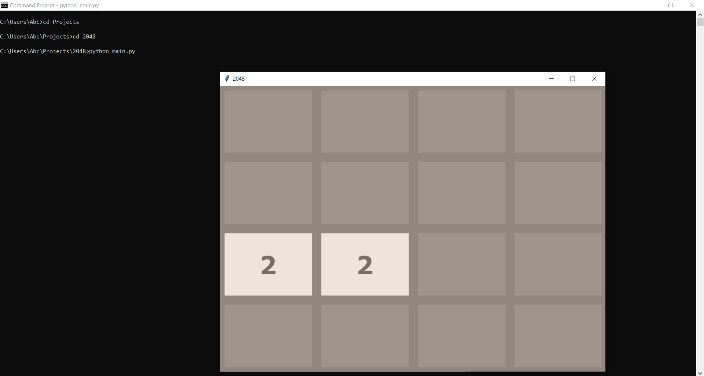

## GAME 

2048 is a **mathematical puzzle** game created by **Gabriele Cirulli**. It has a 4x4 board with 16 tiles. Initially all tiles have have 0 except the two tiles with value 2. We can slide the tiles in upward, downward, left and right directions. 2 tiles with same value merge when they touches each other. A random empty tile is given a value of 2 with every valid move. The player wins when a tile reaches the number **2048** and loses when there are no empty tiles left on the board.

### How to play

Press the following keys for movement-
* **'w'** for up move
* **'s'** for down move
* **'a'** for left move 
* **'d'** for right move

### Let's Try

* Clone the repositry to your local system.
* Run the game(make sure you have python installed on your local system).

* Play using the keys mentioned above.
